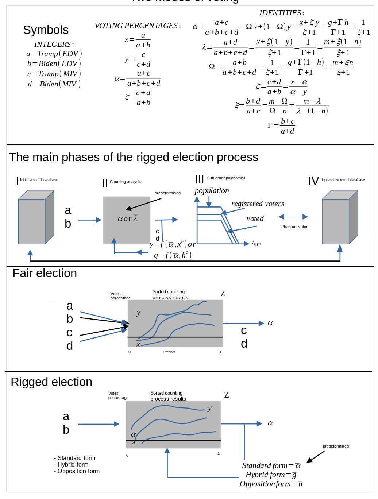

```{r, eval=F, echo=F}
rmarkdown::render("index.Rmd")
```

```{r, echo=F, message=F, warning=F}
### Loading equations
#source('inst/script/stylized.R')
#load("~/research/ManifoldDestiny/data/eqpar.rda")
#modlat <- eqpar$meql
```


```{r, eval=F, echo=F}
pkgdown::build_site()
pkgdown::build_vignette()
pkgdown::build_home()
pkgdown::build_articles()
pkgdown::build_news()
usethis::use_news_md("")
system("cp inst/Presentation.html docs/articles/Presentation.html")
system("cp inst/Graphical.html docs/articles/Graphical.html")
system("cp inst/man_bib.bib docs/stuff/man_bib.bib")
```

Ed. Solomon

> "At the very core of this article lay the assumption of Causality, that the Effect cannot precede the Cause; likewise, the Aggregate Percentage of a Candidate cannot precede the Election Day and the Mail-in Percentages of that candidate. In a fair election, the aggregate cannot be known until after all ballots are cast; in an election that is unfair, where the aggregate was predetermined, the aggregate becomes the cause and the Mail-in Vote (and/or the Election Day Vote) becomes the effect...and the laws of mathematics allow us to readily discern between which was the cause...and which was the effect."

> To Paraphrase Immanuel Kant:  “The causation is the thing without which, is a condition of possibility of a thing, and so it is satisfied in the thing.”  

<br>
<br>
<br>
<br>
<br>

```{r, echo=FALSE, out.width="75%", fig.cap=""}

```


```{r, echo=F, eval=T}
knitr::knit_exit()
```

# Now
vignettes/stylized_model.Rmd
vignettes/Application_Dallas.Rmd

data-raw/
inst/script/symbolic/pysympy.py
inst/script/application_dallas.R
inst/script/application_dallas.R
inst/odg/main_sheet.odg
data-raw/DATASET.R
R/class.R
vignettes/general_algorithm.Rmd
vignettes/stylized_model.Rmd
data-raw/DATASET.R
inst/StylizedModel.Rmd
inst/General_alogorithm.Rmd
inst/sty_presentation.Rmd  
inst/odg/main_sheet.odg
inst/sty_presentation.Rmd   
## Clark and Washoe
https://docs.google.com/document/d/1TEt-ZqPkX0jcpFLoE6PAbCZh0s8kxFzcsKC_3f0dShk/edit#
## Maricopa
https://docs.google.com/document/d/1V5drFEwOqVuwpmkepPNfRgWVYwW72MvVqK15qAEx3Ok/edit#
https://docs.google.com/document/d/1f8-h_wHNBVJsUW1UBISGercDkFPyk2HrMmEPCL7LqO8/edit#i
##Pascal Tet Formation
https://docs.google.com/spreadsheets/d/1spDerF9g3tAzng-THlKYr3U_0KOQz40rMuxJ-OT9Jdg/edit#gid=1272764919
## Old
### Maricopa
https://docs.google.com/document/d/1-9qbBtTqiGlAurJjEbtVt6lBUi9MKTqPR-xb3FpHx-A/edit#
https://coderwall.com/p/elfkaq/editing-google-docs-with-vim
https://docs.google.com/spreadsheets/d/1R78hoPiP_sleD3L7QtvuE5R-3kf2Xob20bMXQeChke8/edit#gid=173566074
### Dallas
https://docs.google.com/document/d/1u8XTDJsyYVFOyuOly1Xs6XjOAAdKFW88C7q624lpAz4
# Spreadsheets
https://docs.google.com/spreadsheets/d/1x1w2hv8JdAA5Zq5C-SbmsSBTA1fhO1aUuDyFRgEeHK0/edit#gid=0
https://docs.google.com/spreadsheets/d/1e_Hqb4lIYdfjehEXRv9c9gFHPG-4Z-1tSjrOX_n2G98/edit#gid=2045784139A
https://docs.google.com/spreadsheets/d/1DYotD54PsrTREk4dZ3I04uVDa7z2FqH5DSNGjD11XrI/edit#gid=0
https://docs.google.com/spreadsheets/d/1tAB6sjG7P-0y6PzxyYDvKMbYDK833MgQhfLti5Ip6Gg/edit#gid=1217173103
# Links
https://github.com/lotariohw26/ManifoldDestiny
https://lotariohw26.github.io/ManifoldDestiny/
https://plotly-r.com/exporting-static-images.html
# Lombardo
https://docs.google.com/document/d/1O_5Rs29mJut8NfOtFIW2chN5NC6TyFwVkkCZX7PyZIA/edit#heading=h.tp0g9ruvaiuu
