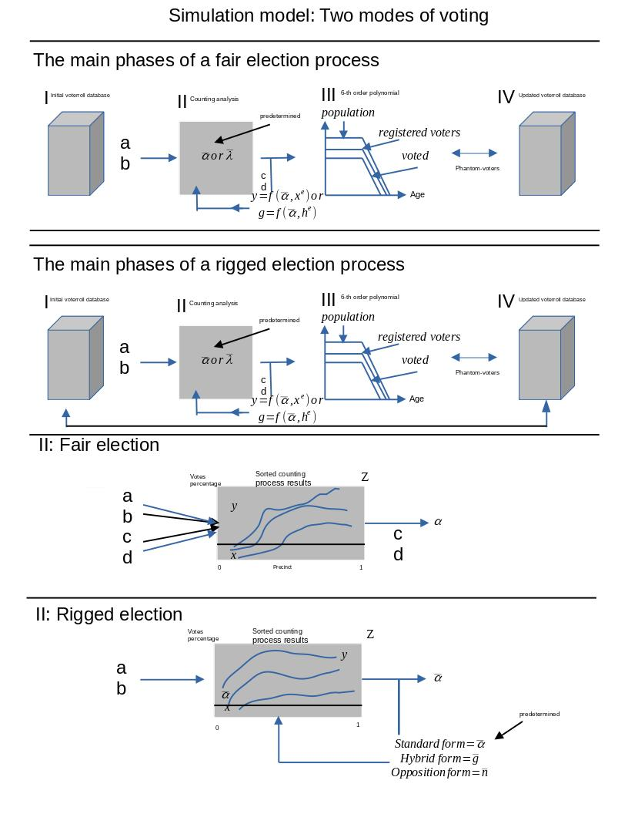

# Overview

# Phase 1:

-   Inflate the Registration Database (“credit line” of Phantom voters)

# Phase 2:

-   Manifold

# Phase 3:

-   Polynomial

# Phase 4:

-   Clean up the Registration Database
